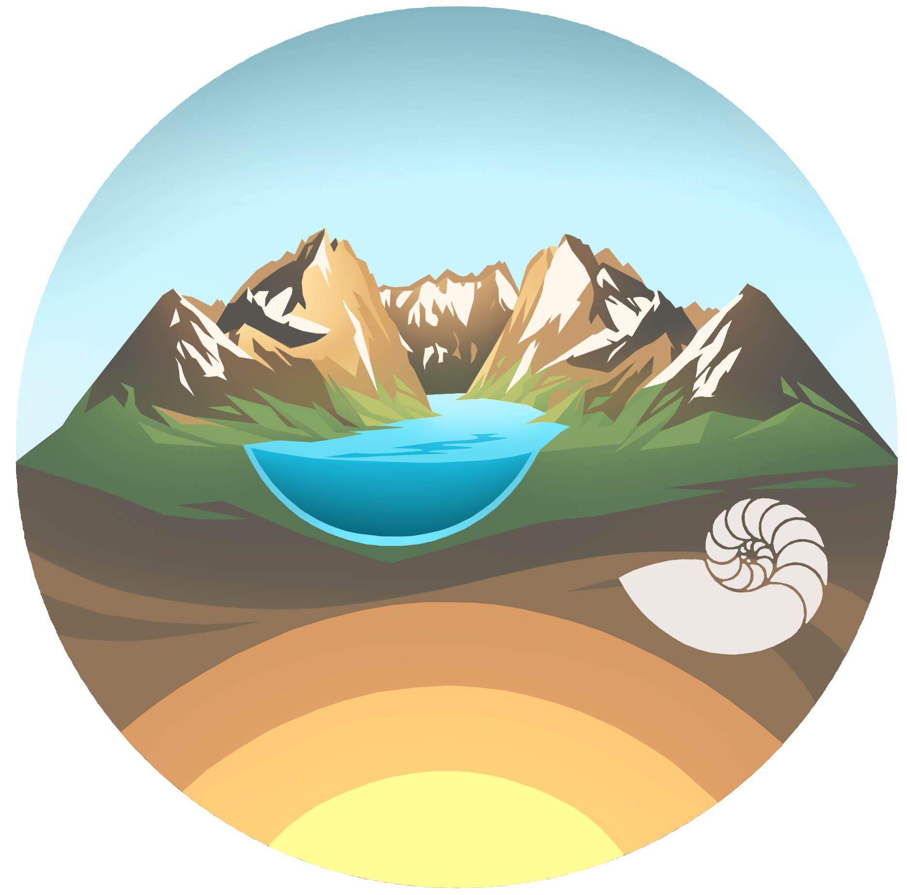

\

# Earth System Research and Training at FAU

```{r, echo=FALSE, out.width="30%",  out.extra='style="float:right; padding:30px"'}

```

This project is part of a broader initiative to strengthen Earth system science within Europe. Recent national and international reports have highlighted the need to increase research and training opportunities in the Earth sciences, with more emphasis on systems thinking and interdisciplinarity. Addressing today’s environmental challenges requires engagement across temporal and spatial scales and at the interfaces between Earth system spheres (atmosphere, biosphere, geosphere, hydrosphere), while also fostering collaboration with the social sciences and humanities. Effective communication of complex findings are essential to ensure knowledge is transferred beyond the scientific community. Science diplomacy provides the necessary framework for understanding how scientific knowledge informs international negotiations and policy in order to address global challenges that cannot be addressed within a single country or discipline.

\

# New MSc program in Earth System Dynamics and Evolution

A new international Masters of Science in *Earth System Dynamics and Evolution* will provide training in Earth system science and science diplomacy, with an emphasis on inter- and transdisciplinary research. The program is funded by the Elite Network of Bavaria and is a collaboration between Friedrich-Alexander University of Erlangen-Nuremberg (FAU), where the program is based, and the University of Bayreuth (UBT).

We are seeking **six post docs for up to five years each** to support this initiative. Postdocs in the cohort will undertake independent projects in Earth system science and/or science diplomacy in collaboration with a project leader (details below), while also working together on joint teaching initiatives related to the overarching research theme. Postdocs will be mentored and encouraged to pursue their own research ideas. Applicants are expected to apply for research grants, and should show willingness to conduct independent research and pursue a habilitation. A habilitation is an additional degree that can be obtained in Germany, which recognises excellence in research and teaching - it requires engaging in a range of tasks that are relevant to a career in academic research (e.g., publishing, grant writing, teaching, curriculum development, student supervision).

At the Department of Geography and Geosciences at FAU and the Bayreuth Centre for Ecology and Environmental Research (BayCEER) **climate research** is a key focal point. Our work encompasses a broad spectrum: from reconstructing geochemical cycles and characterising biodiversity crises in deep time, to studying water and weather systems over recent decades, to future projections, with remote sensing, climate modeling, and biodiversity modeling. The **Science Diplomacy Lab** at FAU is a new initiative that aims to support training and research linking **Earth system science** to **science policy** and **diplomacy**. 

More information about available positions can be found [here](jobs.html).

```{r, echo=FALSE, out.width="20%",  out.extra='style="float:left; padding:30px"'}


```


